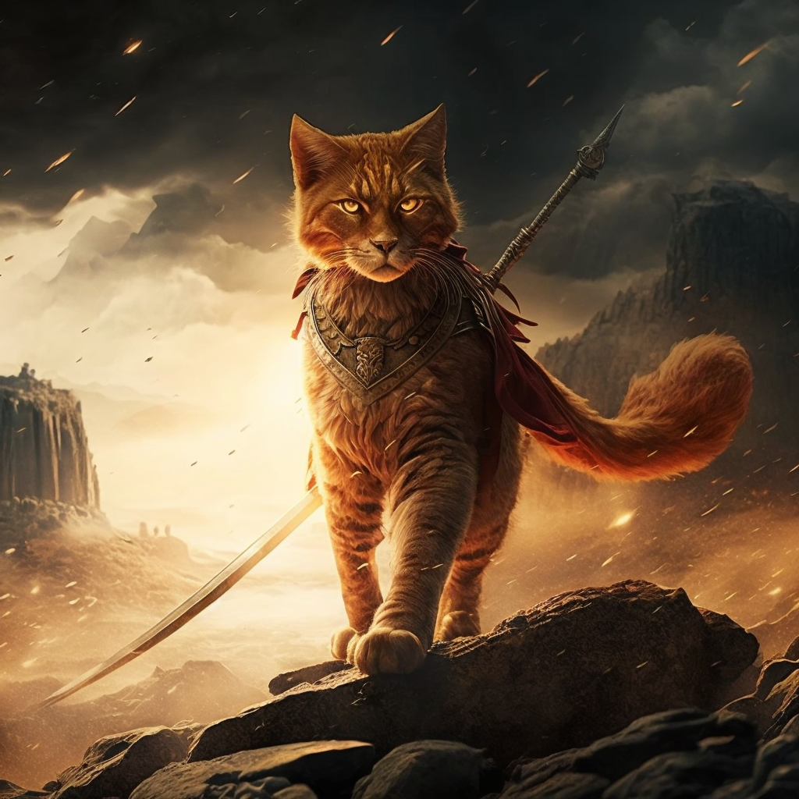

### Name

Catley's Revenge

### Platform

PC

### Monetize

free

### Target group/age

7+

### Type

Action-RPG, Adventure, Management and Puzzle

### Game summary

In a world of medieval times in which the little cat Catley became an alley cat after its glory days. He was stripped of his hat, his sword but also of an object that was dear to him. After a few months, he decides to take revenge on those who took everything from him. He will have to go through the village looking for clues to find the place where his enemies are hiding, but he will have to build his little empire to increase his strength by finding allies to join his clan.

### Game outline

It’s a little 3D open world in which the character can move freely and carry out side quests to advance the main story. The character will have the opportunity to learn abilities for combat against different types of enemies such as archers, knights or even more fearsome bosses. The game is also interactive to allow the player to better customize the game for each player.

### Unique selling points

open world
new story of Catventure: The Return of Lost Business
interactive

### Similar competitive products

Le Chat Potté (2011), Zelda

### Gameplay

**Sword Attack** : High Damage
**Claw Attack** : Only in feline mode, Low Damage, Fast Attack
**Hat attack** : Medium Damage, Distant Attack
**Boots** : Speed

Is scary of water → take damages in water
Have only 9 health points → lose 0.5 hit points per damage
