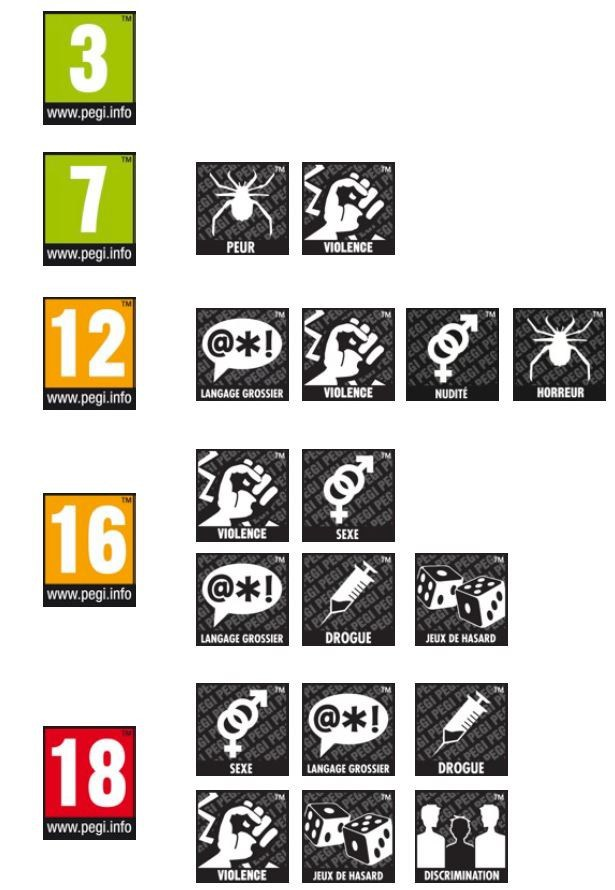

# Research notes

## Market

"Catley's Revenge" is a little 3D open world in which the character can move freely and carry out side quests to advance the main story. The character will have the opportunity to learn abilities for combat against different types of enemies such as archers, knights or even more fearsome bosses. The game is also interactive to allow the player to better customize the game for each player.

In a world of medieval times in which the little cat Catley became an alley cat after its glory days. He was stripped of his hat, his sword but also of an object that was dear to him. After a few months, he decides to take revenge on those who took everything from him. He will have to go through the village looking for clues to find the place where his enemies are hiding, but he will have to build his little empire to increase his strength by finding allies to join his clan.

## Target audience/customer

The minimum age for playing the game is 7 years and older. The product will be mainly used by people who like investigations and interactive adventures and playing the role of felines..

---

# Comparison table

## Competitor

| **Name** | Catley's Revenge | Le chat Potté (2011) | The Legend of Zelda: Skyward Sword(2021) |
| :-: | :-: | :-: | :-: |
| **Link** |  | not shared | https://www.zelda.com/skyward-sword-hd/ |
| **Price** | free | 40€ (=42,60$) | 59,99$ |
| **Target age** | 12+(PEGI[^1]) | 12+(PEGI) | 10+(ESRB[^2]), 12+(PEGI) |
| **Platform** | PC | Wii, PS3, Nintendo DS, Xbox 360 | Wii, Nintendo Switch |
| **Game mode** | Solo | Solo, Multi | Solo, Multi |
| **Type** | Action-RPG, Adventure, Management, Puzzle | Action | Adventure, Fantaisic, Dungeon, Puzzle |

[^1]: PEGI
The ISFE (Interactive Software Federation of Europe) founded PEGI (Pan-European Game Information) in 2003, a system for classifying video games by age and content. The primary objective of PEGI is not restrictive, but informative. By knowing the pictograms, parents can see at a glance the nature of the content of a game and thus avoid putting unsuitable games in their children's hands.
Source : https://www.culture-games.com/capsule-technique/pegi-le-systeme-devaluation-europeen-des-jeux-video

[^2]:ESRB
Since 1994, ESRB (Entertainment Software Rating Board) ratings provide information about what’s in a game or app so parents and consumers can make informed choices about which games are right for their family. Ratings have 3 parts: Rating Categories, Content Descriptors, and Interactive Elements.
Source : https://www.esrb.org/

