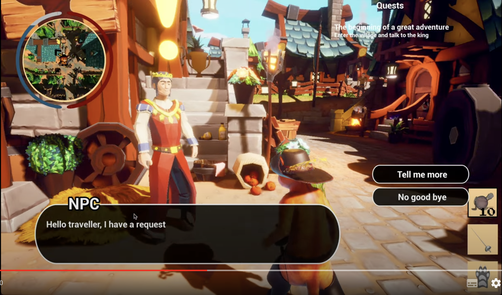

# Technical Specification Document for Caton's Revenge

## Introdution

The goal of this document is to provide a technical overview of the game Caton's Revenge. This document will be updated as the game progresses.

## Glossary

| Term          | Definition                                                                    |
| :------------ | :---------------------------------------------------------------------------- |
| Git           | A version control system.                                                     |
| GitHub        | A website that hosts Git repositories.                                        |
| UE4           | Unreal Engine 4.27                                                            |
| Blueprint     | A visual scripting language for UE4.                                          |
| Texture       | A file used to define the surface properties of a 3D object in UE4            |
| Material      | A file used to define the surface rendering of a 3D object in UE4             |
| Mesh          | A file used to define the geometry of a 3D object in UE4                      |
| Skeletal Mesh | A file used to define the geometry of a 3D object in UE4 that can be animated |
| Animation     | A file used to define the movement of a 3D object in UE4                      |
| NPC           | Non-Playable Character                                                        |
| AI            | Artificial Intelligence                                                       |
| UI            | User Interface                                                                |
| HUD           | Heads-Up Display                                                              |
| Open World    | A game world that is not restricted to a single level.                        |
| Level         | A single playable area in a game.                                             |
| Mixamo        | A website that provides free 3D models and animations, made by Adobe.         |

# Requirements

## Unreal Engine 4.27
We must use UE4.27 for this project. Because it's lightweight related to unreal engine 5.0 and it's easy to use.

## Git
We must use Git for version control and to work in team. and also we must use GitHub to host our project.

# Conventions

## Naming 
Folders, Files, Blueprints, Actors, Classes, Variables, Functions, and other assets should be named in a way that is easy to understand and consistent with the rest of the project. It's why we used PascalCase for folders, files, blueprints, actors, classes, and other assets. And we used camelCase for variables and functions.

## Folder Structure

We used this Folder structure for our project:

<details>
<summary>Folder Structure <b>Click to expand</b></summary>

```
Caton's Revenge
    ├── Content
    │   ├── Characters
    │   │   ├── Player
    |   |   |   ├── Meshes
    |   |   |   ├── Animations
    |   |   |   ├── Materials
    |   |   |   ├── Textures
    |   |   |   └── Controller
    │   │   └── NPC
    |   |       ├── Villagers
    |   |       |   ├── Meshes
    |   |       |   ├── Animations
    |   |       |   ├── Materials
    |   |       |   ├── Textures
    |   |       |   └── AI
    |   |       ├── Enemies
    |   |       |   ├── Meshes
    |   |       |   ├── Animations
    |   |       |   ├── Materials
    |   |       |   ├── Textures
    |   |       |   └── AI
    |   |       ├── Bosses
    |   |       |   ├── Meshes
    |   |       |   ├── Animations
    |   |       |   ├── Materials
    |   |       |   ├── Textures
    |   |       |   └── AI
    |   |       └── Animals
    |   |           ├── Meshes
    |   |           ├── Animations
    |   |           ├── Materials
    |   |           ├── Textures
    |   |           └── AI
    │   ├── Environment
    |   |   ├── Houses
    |   |   |   ├── Meshes
    |   |   |   ├── Materials
    |   |   |   └── Textures
    |   |   ├── Props
    |   |   |   ├── Meshes
    |   |   |   ├── Materials
    |   |   |   └── Textures
    |   |   ├── Vegetation
    |   |   |   ├── Meshes
    |   |   |   ├── Animations
    |   |   |   ├── Materials
    |   |   |   └── Textures
    |   |   ├── Maze
    |   |   |   ├── Meshes
    |   |   |   ├── Materials
    |   |   |   └── Textures
    |   |   └── Others
    |   |       ├── Water
    |   |       |   ├── Materials
    |   |       |   ├── Textures
    |   |       |   ├── Animations
    |   |       |   └── Sound
    |   |       ├── Sky
    |   |       |   ├── Materials
    |   |       |   ├── Textures
    |   |       |   └── Animations
    |   |       ├── Particles
    |   |       |   ├── Materials
    |   |       |   ├── Textures
    |   |       |   └── Animations
    |   |       └── Sound
    |   |       |   ├── Music
    |   |       |   ├── Ambiant Sound
    |   |       |   └── Sound Effects
    │   ├── UI
    |   |   ├── Fonts
    |   |   ├── Images
    |   |   ├── Main Menu
    |   |   |   ├── Play
    |   |   |   ├── Settings
    |   |   |   |   ├── Audio
    |   |   |   |   ├── Graphics
    |   |   |   |   └── Controls
    |   |   |   ├── Credits
    |   |   |   └── Quit
    |   |   ├── HUD
    |   |   |   ├── Pause
    |   |   |   ├── Save
    |   |   |   ├── Map
    |   |   |   ├── Quests
    |   |   |   ├── Audio Settings
    |   |   |   ├── Graphics Settings
    |   |   |   ├── Controls Settings
    |   |   |   └── Main Menu
    |   |   └── Others
    |   |       ├── Loading Screen
    |   |       └── Death Screen
```
</details>

## Git

### Branches

We used theses branches for our project:
- Main
- Documents
- Prototype
- Demo
- Level Design
- Mechanics Design

### Commits

The commit message should be written in english and should be clear and concise, It should not exceed 50 characters and it should be meaningful.

# Assets

We have used theses websites to get assets for our project:
- [Mixamo](https://www.mixamo.com/)
- [Sketchfab](https://sketchfab.com/)
- [Craftpix](https://craftpix.net/)
- [Unreal Engine Marketplace](https://www.unrealengine.com/marketplace/en-US/store)
- [Universal Soundbank](https://universal-soundbank.com/)
- [cgtrader](https://www.cgtrader.com/)

## Environment
For the environment we mainly use a free open source asset from the Unreal Engine Marketplace called "FANTASTIC - Village Pack" by Tidal Flask Studios. With this asset we created the world of Caton's Revenge.
We have enlarged the map and added several locations like:
- a Second Village
- a Forest
- an Ocean
- a Mountain range
- a Maze


<br><br>

[__Link to the Asset__](https://www.unrealengine.com/marketplace/en-US/product/fantastic-village-pack)

## Characters

### Player

For the player character we use a free open source asset from Sketchfab called "Puss in Boots" by CVRxEarth. This asset is cartoony and realistic, there is also a skeletal mesh provided with this asset so that it can be easily animated. We also added a controller to the character to make it playable.

<br><br>

[__Link to the Asset__](https://sketchfab.com/3d-models/puss-in-boots-9b657d49d8a847bdb141e156caf55003)

### Enemies

For the enemies we use the characters from Mixamo and cgtrader following you will find the different characters.

1. The Knight<br>
    <br><br>
    [__Link to the Asset__](https://www.mixamo.com/#/?page=1&query=paladin&type=Character)

2. The Assassin<br>
   <br><br>
    [__Link to the Asset__](https://www.mixamo.com/#/?page=1&query=erika&type=Character)

3. The Bandit<br>
   <br><br>
    [__Link to the Asset__](https://www.cgtrader.com/free-3d-models/character/man/fantasy-bandit)

4. The Brute<br>
   <br><br>
    [__Link to the Asset__](https://www.mixamo.com/#/?page=1&query=brute&type=Character)


#### <u>Finally we use only the Knight and the Brute for the Beta Version</u>
### Villagers

For the villagers we have used a pack with 14 differents villager, this pack is open-source and come from Craftpix:
<br>


[__Link to the Asset__](https://craftpix.net/freebies/free-medieval-3d-people-low-poly-models/?num=1&count=4&sq=peasant&pos=0)

### Antic Dealer
<br><br>
[__Link to the Asset__](https://www.mixamo.com/#/?page=1&query=peasan&type=Character)

### Bosses
1. Boss #1<br>
    <br><br>
    [__Link to the Asset__](https://www.mixamo.com/#/?page=1&query=warrok&type=Character)

2. Boss #2<br>
    <br><br>
    [__Link to the Asset__](https://www.mixamo.com/#/?page=1&query=maw+j+laygo&type=Character)
#### <u>Finally we have not implemented it for the Beta Version</u>
### Animals
For the animals we have also used a pack with 10 different animals, this pack is open-source and come from Craftpix:

<br>


[__Link to the Asset__](https://craftpix.net/freebies/free-wild-animal-3d-low-poly-models/?num=1&count=49&sq=farm%20animals&pos=11)

## Sounds

### Music

For the music we have used the Universal Soundbank, we have used some musics for theses locations:

1. Main Village
2. Forest
3. Tavern

## Ambiant Sounds

For the ambiant sounds we have used the Universal Soundbank, we have used the following sounds:

1. A Talking Crowd
2. Dog Barking
3. Tavern
4. Animals
5. Water
6. Wind

## Sound Effects

For the sound effects we have used the Universal Soundbank, we have used the following sounds:

1. Sword Attack #1
2. Sword Attack #2
3. Punch Attack #1
4. Punch Attack #2
5. Kick Attack #1
6. Kick Attack #2
7. Walking
8. Sprinting
9. Jumping

## Animations

### Player

For the player animations we have used the animations from Mixamo following you will find the list of the differents animations.

1. Idle
2. Walk
3. Jump
4. In the air
5. Landing
6. Punch #1
7. Punch #2
8. Punch #3
9. Kick #1
10. Kick #2
11. Sword Attack #1
12. Sword Attack #2
13. Fighting Idle
14. Take Damage #1
15. Take Damage #2
16. Take Damage #3
17. Death

### Enemies

For the enemies animations we have used the animations from Mixamo following you will find the list of the differents animations.

1. Idle
2. Walk
3. Attack
4. Take Damage
5. Death


### Bosses

For the bosses animations we have used the animations from Mixamo following you will find the list of the differents animations.

1. Idle
2. Walk
3. Attack
4. Power-Up
5. Take Damage
6. Death

### Villagers

For the Villagers animations we have used the animations from Mixamo following you will find the list of the differents animations.

1. Idle
2. Walk
3. Talk
### Animals

For the animals animations we have made it ourselves following you will find the list of the differents animations.

1. Idle
2. Walk

# Gameplay
In this section we will explain the gameplay of the game.

## Controls
Here is the list of the controls of the game:

| Key                | Action           |
| ------------------ | ---------------- |
| Z                  | Move forward     |
| S                  | Move backward    |
| Q                  | Move left        |
| D                  | Move right       |
| Space              | Jump             |
| Left Shift         | Sprint           |
| Left Mouse Button  | Main Attack      |
| Right Mouse Button | Secondary Attack |
| Mouse Wheel        | Change Weapon    |
| E                  | Interact         |
| M                  | Open Map         |
| P                  | Show Quests      |
| Tab                | Target enemy    |
| Escape             | Pause            |
| 1                  | Weapon 1         |
| 2                  | Weapon 2         |
| 3                  | Weapon 3         |

<br><br>

## Combat

For the combat system we have choose two type of combat, the hand-to-hand combat and the sword combat.

With the hand-to-hand combat you can use at least 2 different attacks, the punch and the kick.

With the sword combat you can use at least only 1 attack, the sword attack, but there is 2 styles of sword combat, the light and the heavy.

You can change the style of combat by scrolling the mouse wheel.

There is also a feature that allow you to focus one enemy, this feature is called the target enemy, you can activate it by pressing the Tab key. With this feature you can only attack the enemy you are focusing and this enemy is everytime at the center of your screen.

## Collectibles
There is 19 cups all over the worlds that you can collect, when you collect a cup you will get a small reward. When you collect all the cups you will get a big reward.

## User Interface
Here is the list of the differents elements of the User Interface:

The HUD with theses elements:
1. Health Bar
2. Stamina Bar
3. Mini Map
4. Weapon Slot
5. Quests

The Pause Menu with theses elements:
1. Resume (to go back to the game)
2. Save (to save the game)
3. Map (to open the map)
4. Controls (to see the controls)
5. Audio (to change the audio settings)
6. Main Menu (to go back to the main menu)

The Main Menu with theses elements:
1. Play (to start the game)
2. Settings (to change the audio and video settings)
3. Quit (to quit the game)

And some others elements like the death screen, the quest screen, the reward screen, the tutorials screens.

# Level Design

## Map
In this section we will explain the map of the game in general and focus on some others parts.

### The Little Village
The little village is one of the main location of the game, it is the place where you will start the game and where you will find your first quest, it's also here that you're going to complete the tutorials.

### The Main Village
The main village is the most important location of the game, it is the place where there is the most life, it's here that you will find the most of the quests, it's also here that you will find the tavern and the King.

### The Tavern
The tavern is a place of meeting, you will find a lot of quests here.
In the future you will be able to buy some stuff here.

### The Forest
The forest is a dangerous place where you will find a lot of enemies, but you will find also some animals and collectibles here.

### The Mountains
The mountains is a place where you will find a lot of animals, but you will find also some ennemies and collectibles here.

### The Ocean
The ocean is a calm place where you will not find a lot of enemies and animals, but you will find some collectibles here.

### The Maze
The maze is the most difficult place of the game, it's a place where you will find a lot of enemies. The risk here is that the player can get lost, but we have made a system, if the player is really lost and want to drop out he just need to tap enter into the labyrinth, he will be teleported to the entrance.

## Quests

There is 3 types of quests in the game:
- Location Quests (to go to a specific location)
- Beat Quests (to beat a specific enemy)
- recover Quests (to recover a specific item)

At least we have made 6 quests for the game, but we will add more in the future.

### Quest #1
The first quest is a location quest, you can find this quest at the little village, the queen will give you this quest, the goal of this quest is to go to the main village and talk to the king.

In reward of this quest you will get 50% more Stamina speed recovery.

### Quest #2
The second Quest is a location quest, you can find this quest at the main Village, the king will give you this quest, the goal of this quest is to go to the tavern.

In reward of this quest you will get 2 Health Potions.

### Quest #3
The third quest is a recover quest, you can find this quest at the tavern, the bartender will give you this quest, the goal of this quest is to go to the moutain and recover his ring.

In reward of this quest you will get 25% more Stamina.

### Quest #4
The fourth quest is a beat quest, you can find this quest at the main village, the king will give you this quest, the goal of this quest is to go in front of the village and beat a bandit.

In reward of this quest you will get 25% more Health.

### Quest #5
The fifth quest is a beat quest, you can find this quest at the tavern, the king will give you this quest, the goal of this quest is to go in the forest and beat 3 Knights.

In reward of this quest you will get 3 Health Potions.

### Quest #6
The sixth quest is a location quest, you can find this quest at the tavern, a villager will give you this quest, the goal of this quest is to complete the maze.

In reward of this quest you will get 50% more Stamina speed recovery, 25% more Stamina, 25% more Health and 5 Health Potions.

## External Link
Here is the video of the game:

<a href="https://youtu.be/mGeZM_UHPMM"><br> Click here to access the video.</a>

## Credits
Here is the list of the people who have worked on the game:

- **Project Manager**: <a href="https://github.com/Gregory-Pagnoux"> Gregory PAGNOUX</a>
- **Tech Lead**: <a href="https://github.com/pierre2103"> Pierre GORIN</a>
- **Program Manager**: <a href="https://github.com/T3rryc"> Salaheddine NAMIR</a>
- **Software Engineer**: <a href="https://github.com/elisegtr"> Elise GAUTIER</a>
- **Quality Assurance**: <a href="https://github.com/florenthureaux"> Florent HUREAUX</a>

A special thanks to <a href="https://www.linkedin.com/in/konstantinos-dimopoulos-42b62b4/?originalSubdomain=gr"> Konstantinos DIMOPOULOS</a> for his help and his advices.

Thanks to <a href="https://algosup.com/"> ALGOSUP</a> to give us the opportunity to work on a project like this.

<br><br><br><br><br><br><br><br><br><br>